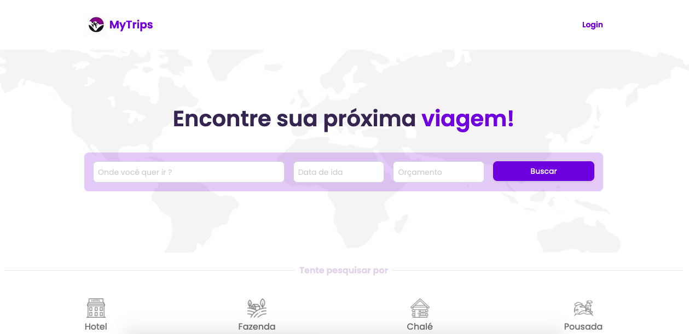
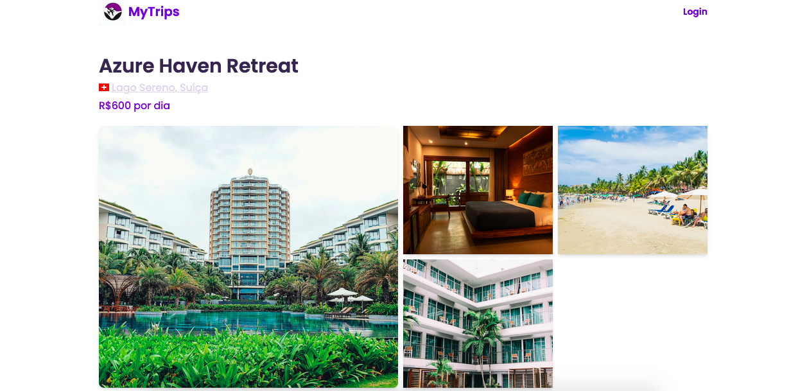

# Trips 🚀

<p>
Bem-vindo à Trips, é uma agência de viagens virtual que foi desenvolvida com o que ã de mais atual em tecnologias, NextJS, usando server components, client components, Next Auth, Prisma e o metodo de pagamento utilazado foi o Stripe.
</p>

# Screens

<p align="center">
  
  
</p>

## Technologies used

- [ReactJS](https://pt-br.reactjs.org)
- [NextJS](https://nextjs.org)
- [Typescript](https://www.typescriptlang.org)
- [Tailwindcss](https://tailwindcss.com)
- [Prisma](https://www.prisma.io/)
- [Auth Next](https://next-auth.js.org)
- [Supabase](https://supabase.com)
- [Stripe](https://stripe.com/br)
- [React Hook Form](https://react-hook-form.com)
- [Zod](https://zod.dev)

## Requirements

You need to install [Node.js](https://nodejs.org)

## How to use it

```bash
# Repository clone
$ git clone https://github.com/Gui-dev/super-store.git
# Install the dependencies
$ npm install
# Prisma Client
$ npx prisma generate
# Run the web server
$ npm run dev
```

The application will be available to access in your browser on localhost
(http://localhost:3000)

The app will be available for access on your browser at
(https://trips-app-lime.vercel.app/)
